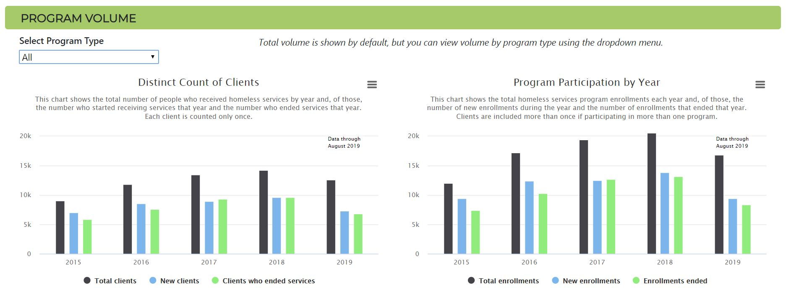
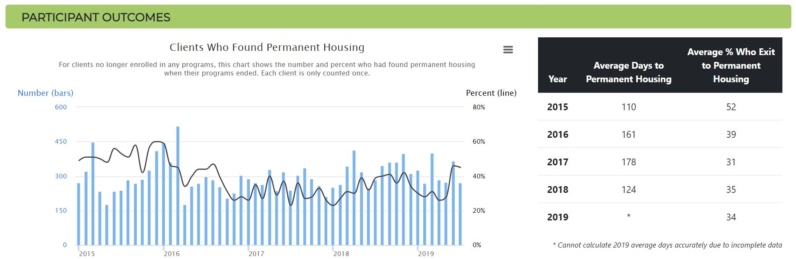
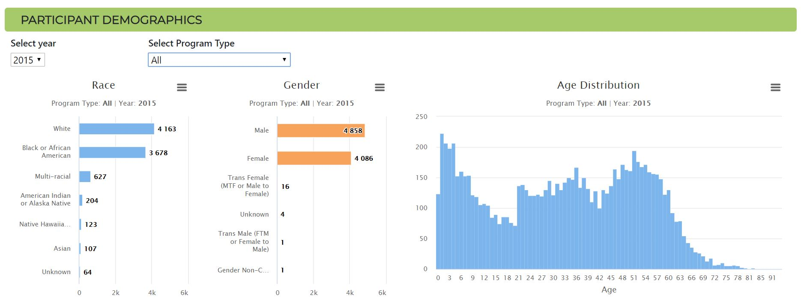

# Sacramento Homeless Services Dashboard

##### A project to provide an interactive dashboard with data from Sacramento County's Homeless Management Information System

* Dashboard live at https://hmis-dashboard.herokuapp.com/
* Source database API: https://hmis-dashboard.herokuapp.com/api/source 
* Data source [here](https://github.com/code4sac/sacramento-county-homeless-hmis-data/tree/master/data).

## Readme contents:
* Context
* Tools Used
* Assumptions Used to Produce Charts
* Execution Instructions 
  
 

## Context

This dashboard was developed to help the community visualize the volume of homeless-related services, how many people find permanent housing through these programs, and the demographics of those who use the services. The data comes from Sacramento's Homeless Management Information System (HMIS), which is used by local homeless service providers within Sacramento County to coordinate care, manage their operations, and better serve those in need of homeless services (referred to in this dashboard as clients). As of early 2020, the most recent public data is through August 2019. The dashboard includes interactive charts that allows users to explore homeless services program volumes, outcomes, and participant demographics by year and program type. An explanation of assumptions made for chart plotting is included at the bottom of this readme.    

## Tools Used

* Initial ETL, exploration, and database build was via a Python Jupyter Notebook.
* Python app now used to clean and load data into database. 
* Python modules used include SQLAlchemy, Numpy, and Pandas.
* Development and production database is PostgreSQL.
* A flask API serves the data from the database.
* Web page design uses HTML5, CSS3, and JavaScript, including Highcarts library.
* Web page hosted on Heroku app. 

## Assumptions Used for Producing Charts

#### Data included for those receiing homeless services clients from January 1, 2015 through August 31, 2019

- While there is some data in the dataset after August 2019, it appears to be incomplete and is not included.

#### Volume/Program Participation

- Total distinct clients and total programs enrollments include those enrolled in a program who do not have an exit date prior to the end of the time period, plus those with an exit date during the time period.
- New clients/enrollments and clients/enrollments ended are straightforward counts of activity within the time period.

#### Outcomes/Program enrollees with permanent housing upon program exit

- For those who exited a program in the period, percent is calculated as the number of clients who exited to permanent housing divided by the total number of exits. Permanent housing is defined as Category 1 as defined in “Variables included in County Data” spreadsheet’s “Exit Destination” worksheet, and includes rapid rehousing and permanent supportive housing. 
- Clients are only counted once. If a client happens to have an exit to permanent housing and an exit in the same period to something other than permanent housing, they are counted as an exit to permanent housing.

#### Outcomes/Average time to permanent housing

- Time is calculated for those who started from street outreach, transitional housing, or day/emergency shelter and exited to permanent housing Category 1 (rapid rehousing and permanent supportive housing).

#### Demographics

- Unknown categories are grouped together. For example, in Race chart, unknown includes categories ‘Client Refused', 'Data Not Collected', 'Client doesn't Know', and ‘NULL’.

## Execution Instructions for Local Development

1. Create a local PostgreSQL database named "sac_hmis_db".
2. Create a local .env file with your PostgreSQL `username` and `password`. See sample-env.txt file for format.
3. Use a terminal to navigate to the main folder and run set-up.py.
4. Run app.py.
5. Open your browser and go to the url `http://localhost:5000/`.

## Project Leads

[Graham Penrose](https://www.linkedin.com/in/graham-penrose-ab6a7b188/) & [Scott Clark](https://www.linkedin.com/in/scott-d-clark/)
